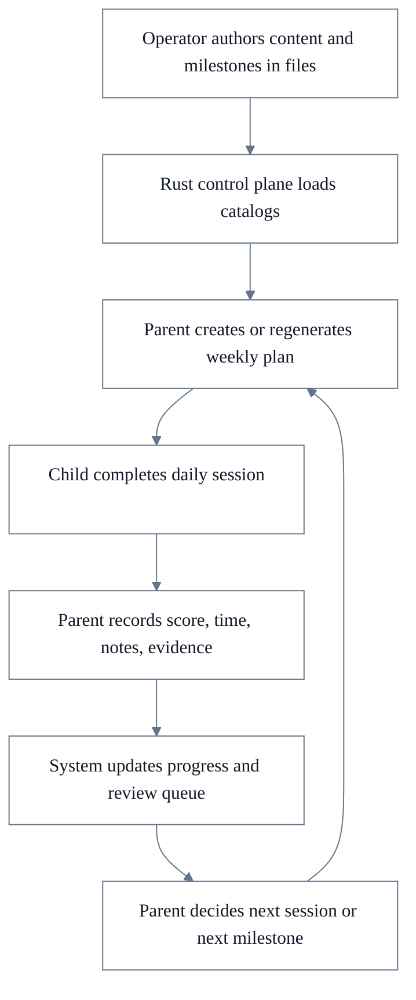
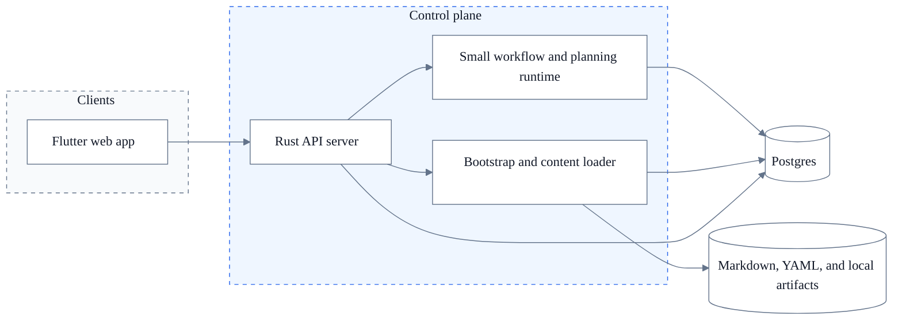

# Joseph Academy Product Definition

Status: **CURRENT MVP CONTRACT**
Last updated: 2026-05-23.

## Purpose

This document is the current product definition for Joseph Academy.

It defines:

- what the first real product is
- what belongs inside the system
- what stays outside the system
- what the first implementation flow should be
- what technical stack should back it

## Product Definition

Joseph Academy is a parent-led learning control plane for building strong fundamentals in maths and English.

It starts with one household and two children.

The first version is not a school platform, not a chatbot tutor, and not a content-generation product.

The first version is a system that helps the parent:

- define capabilities and milestones
- attach curated learning content to them
- plan short daily sessions
- record what happened
- track weak fundamentals
- decide what to do next

## Core Product Decision

The runtime system should own planning, session tracking, evidence, review, and progress.

The runtime system should not own content generation in this milestone.

Content should be created externally by the operator, with or without AI agents, and then checked into the repo as structured markdown or YAML packs.

This keeps the product boundary clean:

- content authoring is an external workflow
- learning operations and progress tracking are the product

## Immediate Scope

The first milestone should support:

- one household
- two learners
- maths and English only
- daily 15-to-30-minute learning sessions
- parent review and weekly planning
- progress tracking in Postgres
- content and milestone definitions in files

Science stays out of scope for now.

## What The Product Will Do

- store learner profiles and baseline levels
- define small executable capabilities such as number bonds or read-aloud fluency
- group capabilities into milestones
- let the parent choose weekly focus areas
- build daily sessions from those focus areas
- record score, speed, notes, and evidence
- maintain a review queue of weak items
- show parent-facing progress and next actions

## What The Product Will Not Do

- generate curriculum automatically inside the runtime
- try to replace school
- act as a free-form AI tutor for children
- start with OCR marking, speech grading, or auto-mastery claims
- start as a multi-tenant SaaS
- require a heavy auth system for the home MVP

## Product Services

The product should be understood as six small services inside one system.

### 1. Content Catalog

Loads and validates file-owned content packs.

This includes:

- capability definitions
- milestone definitions
- content items
- worksheet templates
- reading passages
- speaking prompts

### 2. Planning Engine

Turns learner state plus selected milestones into a weekly plan and a daily session.

### 3. Session Engine

Presents one learner session at a time and records completion state.

### 4. Progress Engine

Stores scores, timings, notes, evidence, and capability status.

### 5. Review Engine

Builds the review queue and the next recommended focus.

### 6. Bootstrap And Access

Loads a small YAML bootstrap file for users, learners, and roles.

## Capability And Milestone Model

The content model should be explicit and repeatable.

### Capability

A capability is the smallest unit the parent wants to teach and observe directly.

Examples:

- `addition_facts_to_20`
- `number_bonds_to_10`
- `times_table_4`
- `division_facts_by_5`
- `read_aloud_level_1`
- `sentence_answer_full_response`

A capability should be small enough to practise in a short session.

### Milestone

A milestone is a group of capabilities that together represent a meaningful checkpoint.

Examples:

- `year1_addition_core`
- `year3_tables_core`
- `reading_fluency_stage_1`

Milestones should be file-owned definitions, not ad hoc records invented in the UI.

### Capability Status

Each learner-capability pair should have a small status model:

- `not_started`
- `introduced`
- `practising`
- `secure`
- `needs_review`

That is enough for the first release.

## File-Owned Definitions Versus Database-Owned State

This boundary is central to the design.

### File-Owned Definitions

These should live in markdown or YAML under version control:

- `UserBootstrap`
- `CapabilityCatalog`
- `MilestoneCatalog`
- `ContentPack`
- `ContentItem`
- `WorksheetTemplate`

### Database-Owned Runtime State

These should live in Postgres:

- `Actor`
- `Learner`
- `LearnerCapability`
- `LearningPlan`
- `Session`
- `SessionActivity`
- `Attempt`
- `EvidenceRecord`
- `ReviewQueueItem`
- `ProgressSnapshot`

Rule:

- files define what can be taught
- Postgres records what actually happened

## First-Class Objects

- `Actor`: one local user identity loaded from bootstrap
- `Learner`: one child profile
- `SubjectTrack`: `maths` or `english`
- `Capability`: one teachable, observable unit
- `Milestone`: a named bundle of capabilities
- `ContentItem`: one worksheet, passage, prompt, or teaching note
- `LearningPlan`: the current weekly plan for a learner
- `Session`: one day’s learning block
- `SessionActivity`: one task inside a session
- `Attempt`: one recorded learner outcome for an activity
- `EvidenceRecord`: score, duration, notes, or file evidence
- `ReviewQueueItem`: one capability that should return soon

These are the objects that should shape the UI, database, and API.

## Product Surface

The system should stay simple and operational.

### Parent Dashboard

This is the main surface.

It should answer:

- what should each child do today
- what is weak
- what improved
- what needs to be repeated
- what should be in the next plan

### Learner Session View

This is the child-facing surface.

It should be:

- full-screen
- distraction-light
- one task at a time
- readable on a laptop or tablet

### Review View

This is where the parent closes the loop.

It should show:

- recent sessions
- repeated mistakes
- capability status changes
- review queue
- next suggested focus

### Operator Surface

For the first milestone, this does not need a rich admin product.

The operator workflow can be:

- edit bootstrap YAML
- edit content and milestone files
- reload or seed the runtime
- inspect Postgres-backed progress through the app

## Core Flow



## Simple Architecture

The first implementation should follow the same broad pattern you already use successfully in dVI, but much smaller.



## Runtime Workflows

The first milestone only needs a small workflow vocabulary.

- `bootstrap.apply`: load users and learners from YAML
- `catalog.reload`: load capabilities, milestones, and content items from files
- `plan.generate`: create or refresh a learner plan
- `session.record`: record a completed session
- `review.rebuild`: recompute review queue and progress summary

This is enough to justify a control-plane model without turning the product into an orchestration experiment.

## Tech Stack

### Recommended Now

- `Flutter web`: parent and learner UI
- `Rust server`: control plane API and runtime ownership
- `Postgres`: durable learner, session, and progress state
- `Docker Compose`: local runtime shape
- `Markdown and YAML`: content, capabilities, milestones, and bootstrap files
- `Local file storage`: worksheet files, reading sheets, and later audio or image evidence

### Explicitly Out For This Milestone

- in-product AI content generation
- OCR marking
- automatic pronunciation scoring
- hosted multi-tenant auth

## Bootstrap And Access

The first MVP can use a very small bootstrap model.

- one YAML file defines users and learners
- username-only login is acceptable for the home MVP
- roles can be lightweight: `parent`, `learner`, `operator`, `viewer`

This is acceptable only for the founder-home phase.

Before sharing with friends or families, the auth boundary should be upgraded.

## Content Authoring Contract

The system should provide a strong contract for content authoring even though content creation stays outside the runtime.

Each content item should declare at least:

- `content_key`
- `subject`
- `capability_keys`
- `milestone_keys`
- `difficulty`
- `activity_type`
- `estimated_minutes`
- `instructions`
- `body`
- `answer_key` when relevant

This is what lets you use any external AI agent or manual workflow to create content safely and repeatedly.

## Suggested Repo Shape

```text
joseph_academy/
  docs/
  content/
    bootstrap/
      users.yaml
      learners.yaml
    maths/
      capabilities.yaml
      milestones.yaml
      packs/
    english/
      capabilities.yaml
      milestones.yaml
      packs/
  rust/
    apps/
    crates/
  fe/
    flutter/
      app/
  data/
    artifacts/
  deploy/
    docker/
```

## What Exists Now Versus Later

### Now

- one family deployment
- local Docker-backed runtime
- file-owned content
- Postgres-owned progress
- parent-led operation
- Flutter web UI
- Rust control plane

### Next

- richer learner session UX
- printable worksheet rendering
- stored audio evidence
- better weekly review summaries
- friend-and-family onboarding

### Later

- stronger recommendation logic
- assisted content validation
- OCR-assisted evidence ingestion
- teacher or mentor mode
- wider academic scope

## Key Recommendation

Build this as a small Rust-owned learning control plane, not as a content-generation app and not as a school platform.

That gives you a product boundary that is strong enough to matter, but still small enough to implement quickly with the stack and architectural style you already trust.
