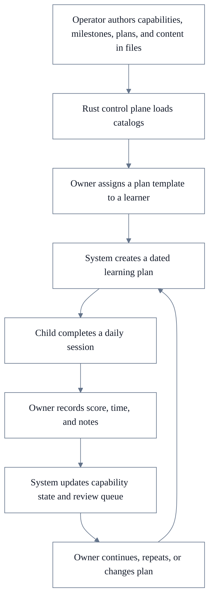
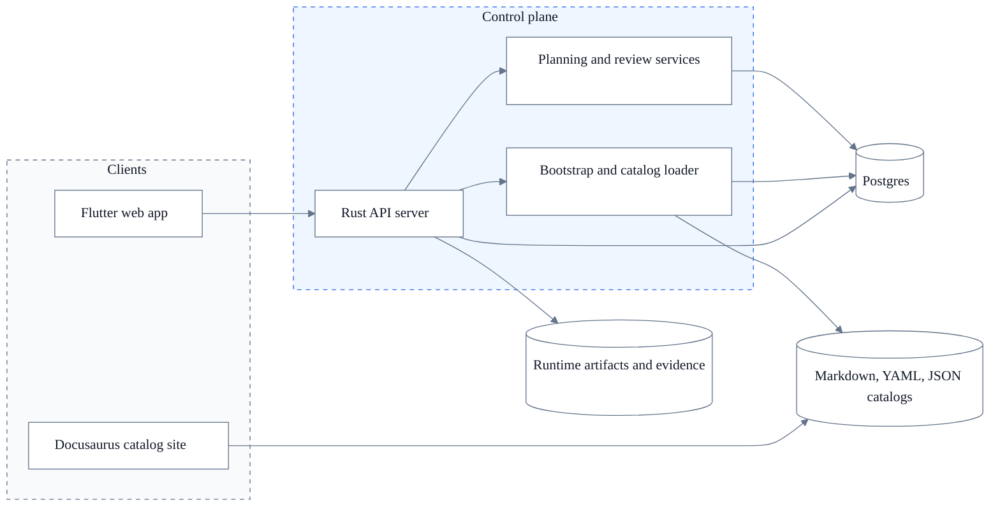

# Joseph Academy Product Definition

Status: **CURRENT MVP CONTRACT**
Last updated: 2026-05-23.

## Purpose

This document defines the current MVP product for Joseph Academy.

It answers:

- what the product is
- who the core actors are
- what is file-owned versus database-owned
- how plans, capabilities, and progress fit together
- what technical shape the first implementation should take

## Product Definition

Joseph Academy is a learning control plane for a small team of owners and learners.

In the first deployment, that team is one household:

- owners are the parents
- learners are the children

Later, the same model should be extendable to:

- a school class
- a tuition group
- a cohort
- a larger learning team

The first version is not a content-generation system, not a school LMS, and not a chatbot tutor.

The first version is a system that helps an owner:

- assign predefined capabilities and milestones
- attach predefined content to them
- assign plan templates to learners
- run daily sessions
- record evidence and progress
- decide what needs repetition

## Core Product Boundary

The runtime product should own:

- identity and access for a small team
- learner profiles
- progress and capability state
- plan assignment and dated learning plans
- sessions, attempts, evidence, and review queues

The runtime product should not own content generation in this milestone.

Content, milestones, capabilities, and plan templates should be created offline by the operator and committed into the repo as structured files.

That is the main product rule:

- repo files define the learning system
- Postgres records what actually happened for each learner

## Immediate Scope

The first milestone should support:

- one household-style team
- a few users with lightweight roles
- two learners
- maths and English only
- predefined capabilities, milestones, and plan templates
- daily 15-to-30-minute sessions
- progress tracking and review in Postgres

Science stays out of scope for now.

## What The Product Will Do

- store learner profiles and baseline levels
- define small executable capabilities such as number bonds or read-aloud fluency
- group capabilities into milestones
- let the operator define milestones and templates
- record score, speed, notes, and evidence
- maintain a review queue of weak items
- show parent-facing progress and next actions

## What The Product Will Not Do

- generate curriculum automatically inside the runtime
- try to replace school
- act as a free-form AI tutor for children
- start with OCR marking, speech grading, or auto-mastery claims
- start as a multi-tenant SaaS
- require a heavy auth system for the home MVP

## Identity And Team Model

The identity boundary should stay simple and team-centered.

### Team

The working group for learning operations.

In the first deployment, this is the household.

Later, it could be:

- one class
- one subgroup
- one batch
- one school section

### User

One login identity loaded from bootstrap.

Examples:

- owner
- learner
- coach

### Team Membership

The role assignment of an user inside a team.

The first role set can stay small:

- `owner`
- `learner`
- `coach` (optional later)

### Learner

The learner is always the student profile.

A learner should have at least:

- `learner_id`
- `display_name`
- `date_of_birth`
- `sex`
- `current_age`
- `current_level`
- `notes`

The learner may be linked to an user for login, but the learner profile remains its own first-class object.

## Capability, Milestone, Content, And Plan Model

These definitions should be operator-defined and file-owned.

They are not created ad hoc by parents inside the app.

### Capability

A capability is the smallest teachable and measurable unit.

Examples:

- `addition_facts_to_20`
- `number_bonds_to_10`
- `times_table_4`
- `division_facts_by_5`
- `read_aloud_level_1`
- `sentence_answer_full_response`

Each capability should declare at least:

- `capability_id`
- `subject`
- `title`
- `recommended_age`
- `recommended_level`
- `description`

### Milestone

A milestone is a named bundle of capabilities.

Examples:

- `year1_addition_core`
- `year3_tables_core`
- `reading_fluency_stage_1`

Each milestone should declare at least:

- `milestone_id`
- `subject`
- `title`
- `recommended_age`
- `recommended_level`
- `capability_ids`

### Content Item

A content item is one reusable learning artifact linked to capabilities.

Examples:

- worksheet
- reading passage
- speaking prompt
- dictation prompt
- teaching note

Every content item should link to one or more capabilities.

That is what makes the content trackable.

### Plan Template

A plan template is a predefined path for working through one milestone or a small capability set.

Examples:

- 7-day number-bonds plan
- 14-day times-tables plan
- 7-day reading-fluency starter plan

Each plan template should declare at least:

- `plan_template_id`
- `title`
- `recommended_age`
- `recommended_level`
- `milestone_ids`
- `capability_ids`
- `session_pattern`
- `duration_days`

## Static Definitions Versus Runtime State

This boundary should stay explicit.

### File-Owned Definitions

These should live in markdown, YAML, or JSON under version control:

- `IdentityBootstrap`
- `CapabilityCatalog`
- `MilestoneCatalog`
- `PlanTemplateCatalog`
- `ContentIndex`
- `ContentItem`

### Database-Owned Runtime State

These should live in Postgres:

- `Team`
- `User`
- `TeamMembership`
- `Learner`
- `LearnerCapabilityState`
- `PlanAssignment`
- `LearningPlan`
- `Session`
- `SessionActivity`
- `Attempt`
- `EvidenceRecord`
- `ReviewQueueItem`

Rule:

- files define the teaching model
- Postgres stores the learner-specific state

## First-Class Objects

- `Team`: household, class, or subgroup boundary
- `User`: one login principal
- `TeamMembership`: role of an user in a team
- `Learner`: one student profile
- `SubjectTrack`: `maths` or `english`
- `Capability`: smallest measurable learning unit
- `Milestone`: grouped capability checkpoint
- `ContentItem`: one reusable learning artifact
- `PlanTemplate`: file-owned recommended learning path
- `PlanAssignment`: link between learner and chosen plan template
- `LearningPlan`: one dated runtime plan for a learner
- `LearnerCapabilityState`: current state of a learner against a capability
- `Session`: one day’s learning block
- `SessionActivity`: one task inside a session
- `Attempt`: one recorded learner outcome
- `EvidenceRecord`: score, duration, notes, audio, or image evidence
- `ReviewQueueItem`: one capability that should return soon

These are the core objects that should shape the API, database, and UI.

## Capability State

Capability status is not part of the static content system.

It is per learner and belongs in the database.

The first status model can stay small:

- `not_started`
- `introduced`
- `practising`
- `secure`
- `needs_review`

That state should be stored on `LearnerCapabilityState` and linked by `capability_id`.

## Planning Model

The planning model should have two layers.

### Plan Template

This is static and file-owned.

It is authored offline by the operator.

It defines the intended path.

### Learning Plan

This is runtime and database-owned.

It is created when a plan template is assigned to a learner for real dates.

It records:

- which learner is following the plan
- when it starts
- which sessions were scheduled
- which sessions were completed
- what changed during execution

This keeps planning clear:

- operator defines the template
- owner assigns or switches the template
- runtime tracks execution

## Product Surface

The system should stay operational and simple.

### Owner Dashboard

This is the main surface.

It should answer:

- what each learner should do today
- which plan is active
- which capabilities are weak
- which milestones are close to completion
- what should be repeated next

### Learner Session View

This is the child-facing surface.

It should be:

- full-screen
- distraction-light
- one task at a time
- readable on laptop and tablet

### Review View

This is where the owner closes the loop.

It should show:

- recent sessions
- repeated mistakes
- capability-state changes
- review queue
- milestone progress

### Catalog Browse Surface

This is the browse-only surface for capabilities, milestones, plan templates, and content items.

This can be rendered through Docusaurus from the same source files.

It is not the editing surface.

Editing remains file-based in the repo.

## Control-Plane Operations

These are not a second system.

These are just the main backend operations the Rust control plane must support.

- `bootstrap.apply`: load teams, users, learners, and memberships from bootstrap files
- `catalog.reload`: parse and validate capabilities, milestones, plan templates, and content indexes
- `plan.assign`: assign a plan template to a learner
- `plan.instantiate`: create a dated learning plan and its sessions from the chosen template
- `session.record`: store the result of a completed session
- `review.rebuild`: recompute learner capability state, milestone progress, and review queue

In the first milestone, these can be simple API handlers and service functions.

They do not require a large workflow engine.

## Core Flow



## Simple Architecture

The first implementation should follow the same broad control-plane pattern you already use in dVI, but much smaller.



## Tech Stack

### Recommended Now

- `Flutter web`: owner and learner operational UI
- `Rust server`: control plane API and runtime ownership
- `Postgres`: durable learner, plan, session, and progress state
- `Markdown`: content pages with frontmatter
- `YAML` or `JSON`: indexes and catalogs for capabilities, milestones, plan templates, and bootstrap
- `Docusaurus`: browse-only catalog surface for operators and owners
- `Docker Compose`: local and VM deployment shape
- `Local file storage`: runtime evidence and generated artifacts

### Explicitly Out For This Milestone

- in-product AI content generation
- browser-based inline editing of capabilities or milestones
- OCR marking
- automatic pronunciation scoring
- heavy external auth
- multi-tenant SaaS packaging

## Content Contract

The content system should feel schema-like even though it is file-based.

Markdown items should use frontmatter.

Example:

```md
---
id: cnt_maths_times_table_4_sheet_01
type: worksheet
subject: maths
capability_ids:
  - times_table_4
milestone_ids:
  - year3_tables_core
recommended_age: 8
difficulty: starter
estimated_minutes: 12
---

# 4 Times Table Practice

...
```

This makes the content easy to validate, render in Docusaurus, and load into the control plane.

## Bootstrap And Access

The first MVP should use a small bootstrap model similar to your existing control-plane systems.

It should define:

- team
- users
- learners
- memberships and roles

Username-only login is acceptable for the home MVP.

Before sharing with other families or schools, the auth boundary should be upgraded.

## Content Versus Data

This distinction should stay visible in the repo.

### Content

Curated source-of-truth learning definitions:

- capabilities
- milestones
- plan templates
- content items
- indexes

### Data

Runtime-produced or runtime-owned material:

- Postgres state
- evidence files
- exports
- reports
- local uploads

## Suggested Repo Shape

```text
joseph_academy/
  docs/
  content/

    catalog/
      subjects.yaml
      capabilities.yaml
      milestones.yaml
      plan_templates.yaml
      content_index.yaml
    library/
      maths/
      english/
  site/
    catalog_docs/
  rust/
    apps/
    crates/
  fe/
    flutter/
      app/
  data/
    artifacts/
    exports/
  deploy/
    config/
    dev/
    production/
    templates/
      bootstrap/
        identity_bootstrap.yaml
        learners.yaml
```

## What Exists Now Versus Later

### Now

- one household team
- file-owned content system
- Docusaurus catalog browsing
- Postgres-owned learner state
- Flutter web UI
- Rust control plane

### Next

- richer learner session UX
- printable worksheet rendering
- stored audio evidence
- stronger progress summaries
- friend-and-family pilots

### Later

- teacher or mentor teams
- school subgroup structures
- assisted content validation
- OCR-assisted evidence ingestion
- wider academic scope

## Key Recommendation

Build this as a small Rust-owned learning control plane with a file-owned curriculum system.

Use Docusaurus to browse the catalogs, Flutter to operate the runtime, and Postgres to track learner-specific truth.

That gives you a clean separation between:

- static learning definitions
- runtime learner state
- operator content workflow
